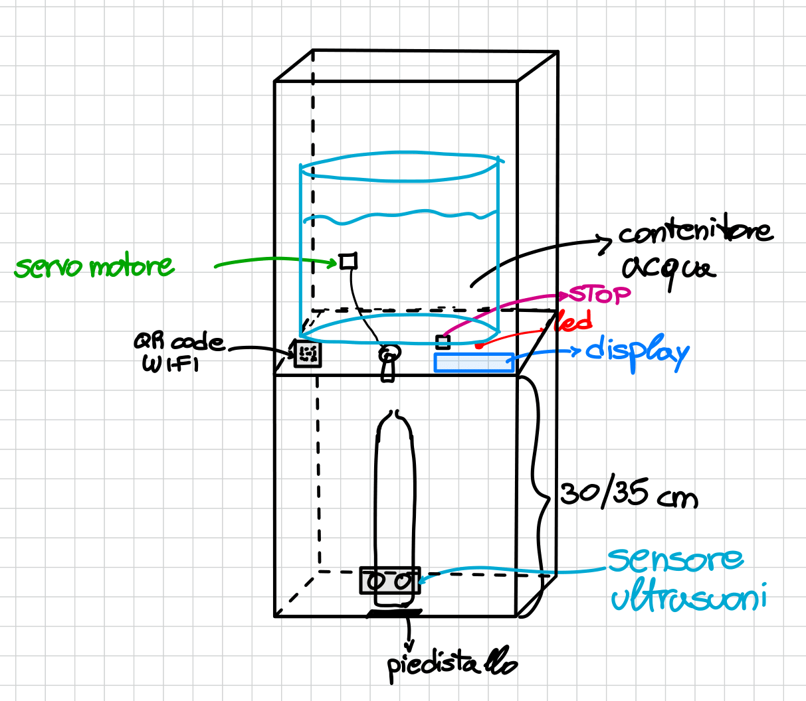

# 🛍️ DistributoreSwag

Benvenuto nella repository del **Distributore Swag**! Questo progetto si occupa della gestione di un distributore d'acqua, controllato tramite un ESP32 e un servo motore.

## 🔧 Cose da migliorare
- [ ] Disconnettere i client automaticamente appena finisce l'erogazione (o c'è un'emergenza)
- [ ] Capire come gestire dignitosamente la questione del famigerato valore 9086 del servomotore
- [ ] Mettere più bevande
- [ ] Mettere la visione "live" della percentuale d'acqua nel sito e diplay
 
## ✅ To-Do List

- [x] Trovare il tappo necessario o individuare una soluzione alternativa *(es. utilizzo di una pompa, taglio diagonale di un tubo con regolazione del flusso tramite foglio di plastica trasparente, ...)*
- [x] Capire bene come funziona il modulo WiFi, inclusi HTTP e protocolli di comunicazione
- [ ] Capire come gestire gli interrupt con ESP32
- [x] Iniziare a progettare la realizzazione pratica del sistema
- [x] Dividerci il lavoro nella pratica

## ✏️ Schema


## 📌 Cose Utili

Ecco alcuni link utili per il progetto:

- 🎥 **Collegamento tappo servo:** [Guarda il video](https://youtu.be/ywjtrN_QuFI) [Guarda il video](https://www.youtube.com/shorts/YKhZU1_dNQs) [Ricerca Amazon](https://www.amazon.it/s?k=tappo+erogatore+tanica&__mk_it_IT=%C3%85M%C3%85%C5%BD%C3%95%C3%91&crid=3QHH02E7DG4O3&sprefix=tappo+erogatore+tanic%2Caps%2C174&ref=nb_sb_noss_2)
- 🔗 **Guida HTTP ↔ ESP32:** [Leggi l'articolo](https://randomnerdtutorials.com/esp32-servo-motor-web-server-arduino-ide/)
- ⚠️ **Come gestire gli interrupts:** [Leggi l'articolo](https://lastminuteengineers.com/handling-esp32-gpio-interrupts-tutorial/)


## ⚙️ Workflow del DistributoreSwag

#### 1. Stato di Pronto
- Il sistema viene collegato e si entra nello stato di **pronto**.
- Vengono effettuati i controlli generali: verifica che i sensori non abbiano ostacoli e che la parte WiFi sia pronta.
- Il display mostrerà: **"PRONTO. COLLEGARSI AL WIFI SWAG"**.
- **STATUS_LED:** 🔵 (BLU).

#### 2. Connessione e Selezione Quantità
- L'utente si collega al WiFi del distributore tramite il telefono e scannerizza il QR per accedere alla pagina locale del distributore.
- Seleziona la quantità di acqua da erogare (**0.2L, 0.33L, 0.5L, 1L**).
- **STATUS_LED:** 🟣 (VIOLA) quando un dispositivo si connette.
- **STATUS_LED:** 🟡 (GIALLO) quando la scelta è stata effettuata.

#### 3. Controllo della Borraccia ed Erogazione
- Il sensore di prossimità verifica se la borraccia è posizionata correttamente.
- Se la borraccia è inserita e alla giusta distanza, inizia l'erogazione e **STATUS_LED sarà 🟢 (VERDE)**.
- Se la borraccia viene rimossa durante l'erogazione:
  - **STATUS_LED sarà 🟡 (GIALLO)**.
  - Il sistema si ricorderà il livello di erogazione e riprenderà quando la borraccia sarà di nuovo in posizione.

#### 4. Fine del Processo
- **Scenario 1:**
  - L'acqua è stata erogata correttamente.
  - Il display mostrerà **"FINITO"** e il buzzer suonerà.
  - Il sistema tornerà allo **stato 1**.
- **Scenario 2:**
  - L'utente preme il pulsante **STOP**.
  - Il sistema si interrompe immediatamente, indipendentemente dallo stato attuale.
  - Il display mostrerà **"RESET"** e **STATUS_LED sarà 🔴 (ROSSO) per qualche secondo**.
  - Il sistema tornerà allo **stato 1**.

### 🛠️ Strumenti

Inoltre, si pensava di usare **PlatformIO** su VS Code per la programmazione delle ESP32 e **GitHub** per la condivisione e la collaborazione sul codice.

Usando Git e GitHub possiamo sfruttare l’estensione per VS Code che permette di caricare i cambiamenti direttamente su GitHub (da VS Code), senza fare 8000 giri inutili.

### 🌲 Tree
```plaintext
.
├── README.md
├── include
│   └── README
├── lib
│   ├── AP
│   │   ├── AP.cpp
│   │   ├── AP.h
│   │   ├── captiveRequestHandler.cpp
│   │   └── captiveRequestHandler.h
│   ├── README
│   ├── button
│   │   ├── button.cpp
│   │   └── button.h
│   ├── buzzer
│   │   ├── buzzer.cpp
│   │   ├── buzzer.h
│   │   └── pitches.h
│   ├── display
│   │   ├── display.cpp
│   │   └── display.h
│   ├── logic
│   │   ├── logic.cpp
│   │   └── logic.h
│   ├── rgb
│   │   ├── rgb.cpp
│   │   └── rgb.h
│   ├── servo
│   │   ├── servo.cpp
│   │   └── servo.h
│   ├── timerControl
│   │   ├── timerControl.cpp
│   │   └── timerControl.h
│   └── ultrasound
│       ├── ultrasound.cpp
│       └── ultrasound.h
├── platformio.ini
├── src
│   └── main.cpp
└── test
    └── README
```
